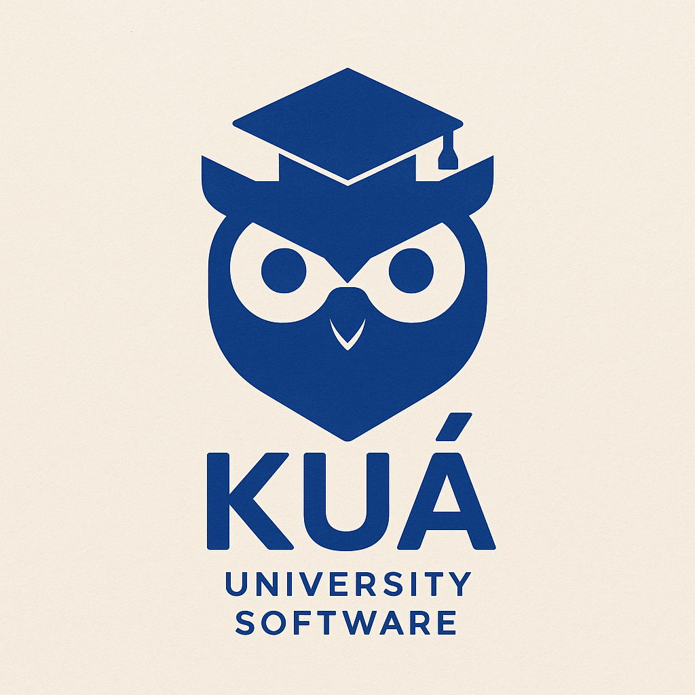

# KUÁ – Universitários que transformam o mercado

 

## ✨ Sobre a KUÁ

A **KUÁ** é uma iniciativa que reúne estudantes universitários de diversas áreas para criar **soluções tecnológicas inovadoras para o mercado**. Mais do que uma empresa de software, somos um **ecossistema colaborativo**, onde ideias se tornam projetos, e problemas reais são resolvidos com criatividade e excelência técnica.

## 💡 Missão

Desenvolver tecnologia acessível, útil e criativa que impacte positivamente o mercado, enquanto formamos profissionais altamente capacitados ainda na universidade.

## 🧩 O que fazemos

- Desenvolvimento de software personalizado
- Aplicações web e mobile
- Soluções em dados e visão computacional
- Sistemas de automação e otimização
- Consultoria em tecnologia

## 🧠 Por que a KUÁ?

- Equipe multidisciplinar de talentos universitários
- Visão inovadora e atualizada
- Colaboração ágil e eficiente
- Comprometimento com excelência técnica

> **KUÁ** — Talentos universitários desenvolvendo o futuro.

---

📫 Entre em contato: [tech.kua@gmail.com]  
🌐 Site em breve: [www.kua.tech](ufpi.br)

